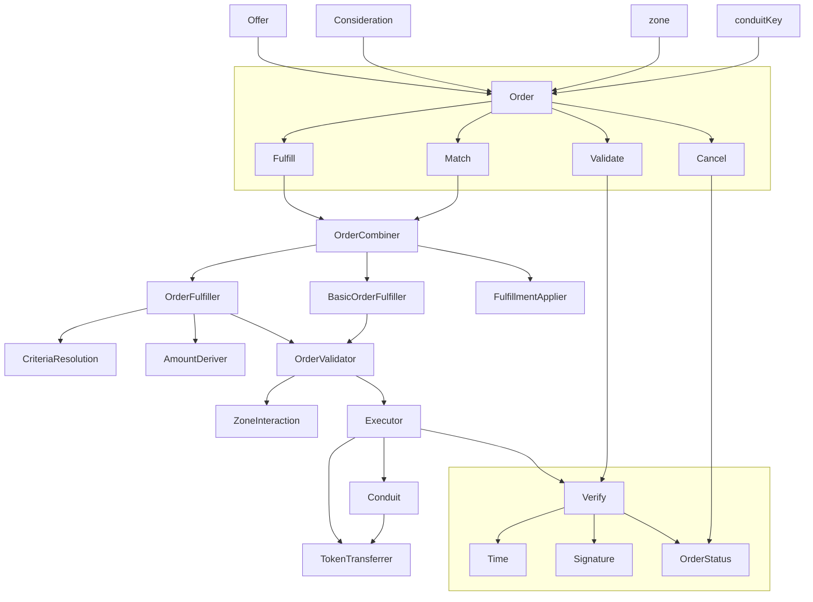

# Seaport

Seaport is a marketplace protocol for safely and efficiently buying and selling NFTs.

## Table of Contents

- [Seaport](#seaport)
  - [Table of Contents](#table-of-contents)
  - [Background](#background)
  - [Diagram](#diagram)

## Background

Seaport is a marketplace protocol for safely and efficiently buying and selling NFTs. Each listing contains an arbitrary number of items that the offerer is willing to give (the "offer") along with an arbitrary number of items that must be received along with their respective receivers (the "consideration").

See the [documentation](docs/SeaportDocumentation.md), the [interface](contracts/interfaces/SeaportInterface.sol), and the full [interface documentation](https://docs.opensea.io/v2.0/reference/seaport-overview) for more information on Seaport.

## Diagram

For a more thorough flowchart see [Seaport diagram](./diagrams/Seaport.drawio.svg).
